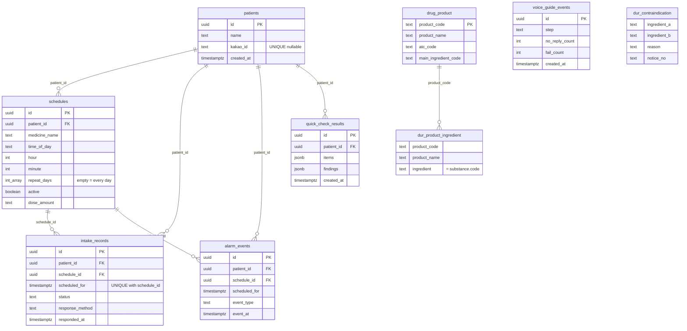

# 모두의 복약 — 데이터 명세서 (ERD)

작성 2026-09-17 · 기준: Supabase 프로젝트 `atzosfqrzsfrveympcfj`, 저장소 `care-app/supabase/*.sql`, 상호작용 DB v1 검토 PDF(2026-08), 건기식 적재 SQL(`tools/hff/sql`). 행 수는 PDF 검토본(8월) 기준이며 현재는 규칙 70개 게시·성분 239종·건기식 약 46,000건.

## 0. 한눈에

데이터베이스는 Supabase Postgres 하나이고 스키마가 둘이다.

| 스키마 | 역할 | 테이블 | 앱 접근 |
|---|---|---|---|
| `public` | 환자·일정·복약 기록·지표 + 식약처 의약품/DUR 참조 자료 | 9 | anon 키로 직접(RLS tier1: 지표·점검 결과는 insert 전용, patients update 차단) |
| `interaction` | 약사 검수 상호작용 규칙 DB v1 + 건기식 제품·원료 매핑 | 15 + 4 (+스테이징 1) | **직접 노출 없음.** `public.quick_check_v1(p_names, p_age, p_conditions)` RPC(security definer)만 읽는다 |

서버 함수 2개: `quick_check_v1`(1분 점검 판정, v2 로직 배포 2026-09-17), `link_kakao(p_patient_id, p_kakao_id)`(카카오 연결, patients.kakao_id 갱신).

앱 흐름과 테이블: 온보딩 3/3 → `patients` insert → 판정 RPC → `quick_check_results` insert → 알람 설정 → `schedules` → 알람 응답 → `intake_records` upsert + `alarm_events` insert.

## 1. public 스키마 ERD

### 1.1 테이블 정의

#### `patients` — 환자(사용자). 인증 없음 — 앱은 기기에 id를 저장해 자기 행을 찾는다.

| 컬럼 | 타입 | 설명 |
|---|---|---|
| `id` | uuid | PK, default gen_random_uuid() |
| `name` | text | NOT NULL. 온보딩 3/3 또는 이름 화면에서 입력 |
| `patient_code` | text | UNIQUE. 보호자 기능 삭제로 미사용(구 행 보존용) |
| `gender` | text | 미사용(B안부터 받지 않음) |
| `birth_date` | date | 미사용(B안부터 받지 않음) |
| `region` | text | 미사용 |
| `phone` | text | 미사용 |
| `kakao_id` | text | 카카오 회원번호. UNIQUE(부분 인덱스). NULL=미연결. link_kakao RPC로만 갱신 |
| `created_at` | timestamptz | NOT NULL default now() |

#### `schedules` — 복용 일정(약 1개 × 시간대 1개). 알람의 원천.

| 컬럼 | 타입 | 설명 |
|---|---|---|
| `id` | uuid | PK |
| `patient_id` | uuid | FK patients.id ON DELETE CASCADE |
| `medicine_name` | text | NOT NULL |
| `time_of_day` | text | 아침/점심/저녁/자기 전 |
| `hour` | int | 0~23 |
| `minute` | int | 0~59, default 0 |
| `repeat_days` | int[] | 0=일…6=토. **빈 배열 = 매일**(설계 결정 1) |
| `active` | boolean | default true |
| `dose_amount` | text | 1회 복용량 표시("1정") |
| `created_at` | timestamptz |  |

#### `intake_records` — 복약 응답 기록. (schedule_id, scheduled_for) UNIQUE — 반드시 upsert(설계 결정 2).

| 컬럼 | 타입 | 설명 |
|---|---|---|
| `id` | uuid | PK |
| `patient_id` | uuid | FK patients |
| `schedule_id` | uuid | FK schedules ON DELETE CASCADE |
| `scheduled_for` | timestamptz | 이 회차의 예정 시각 |
| `status` | text | completed | snoozed | skipped |
| `response_method` | text | 버튼(음성 없음) |
| `responded_at` | timestamptz |  |
| `created_at` | timestamptz |  |

#### `alarm_events` — 알람 지표 로그(insert 전용). 알파 테스트 분석용.

| 컬럼 | 타입 | 설명 |
|---|---|---|
| `id` | uuid | PK |
| `patient_id` | uuid | FK patients |
| `schedule_id` | uuid | FK schedules |
| `scheduled_for` | timestamptz |  |
| `event_type` | text | fired | completed | snoozed | skipped | undone |
| `method` | text | 응답 방식 |
| `event_at` | timestamptz |  |
| `created_at` | timestamptz |  |

#### `voice_guide_events` — 알람 설정 안내(VoiceGuide) 지표(insert 전용). 환자 FK 없음(익명 집계).

| 컬럼 | 타입 | 설명 |
|---|---|---|
| `id` | uuid | PK |
| `step` | text | done | skipped |
| `no_reply_count` | int |  |
| `fail_count` | int |  |
| `button_fallback_count` | int |  |
| `echo_filtered_count` | int |  |
| `tap_interrupt_count` | int |  |
| `created_at` | timestamptz |  |

#### `quick_check_results` — 1분 복용 점검 결과 한 건(insert 전용).

| 컬럼 | 타입 | 설명 |
|---|---|---|
| `id` | uuid | PK |
| `patient_id` | uuid | FK patients |
| `items` | jsonb | {supplements, medicines, names, unmatched, profile{age,conditions}, unmappedIngredients, uncoveredConditions, engine, durUnavailable} |
| `findings` | jsonb | QuickFinding[] — 화면에 보인 그대로(서버 검수 문구) |
| `created_at` | timestamptz |  |

#### `drug_product` — 식약처 의약품 제품 목록(읽기 전용 참조). 제품명 검색용.

| 컬럼 | 타입 | 설명 |
|---|---|---|
| `product_code` | text | PK |
| `product_name` | text |  |
| `company` | text |  |
| `atc_code` | text | 심평원 ATC(있으면) |
| `atc_name` | text | 분류명 |
| `category_code` | text | 식약처 분류번호 |
| `main_ingredient_code` | text |  |

#### `dur_product_ingredient` — 식약처 DUR 제품→성분(정규화 성분명, 읽기 전용).

| 컬럼 | 타입 | 설명 |
|---|---|---|
| `product_code` | text |  |
| `product_name` | text | trigram 인덱스(부분 검색) |
| `ingredient` | text | 정규화 성분 영문 코드 = interaction.substance.code |

#### `dur_contraindication` — 식약처 병용금기 성분쌍(읽기 전용). ingredient_a < ingredient_b.

| 컬럼 | 타입 | 설명 |
|---|---|---|
| `ingredient_a` | text |  |
| `ingredient_b` | text |  |
| `reason` | text | 사용자에게 보일 이유 |
| `notice_no` | text | 고시번호 |
| `product_rows` | int | 원본 제품쌍 수 |

### 1.2 제약·정책 요약
- `intake_records`: `UNIQUE (schedule_id, scheduled_for)`. 알림 재발화·재탭으로 같은 회차에 중복 행이 생기면 안 되므로 앱은 항상 `upsert(onConflict: "schedule_id,scheduled_for")`.
- `schedules.repeat_days = '{}'`은 **매일**. 요일 배열은 정렬·중복 제거된 int[] (0=일 … 6=토).
- `patients.kakao_id`: 부분 유니크 인덱스(`where kakao_id is not null`). anon은 update 불가 → `link_kakao` RPC.
- RLS(tier1): patients select/insert/delete · schedules·intake_records 4동작 · alarm_events·voice_guide_events·quick_check_results insert만 · drug/dur 테이블 select만.

## 2. interaction 스키마 ERD

```mermaid
erDiagram
  substance ||--o{ substance_class_member : "substance_id"
  substance_class ||--o{ substance_class_member : "class_id"
  substance_class ||--o{ substance_class : "parent_id"
  intake_class ||--o{ intake_class_resolution : "intake_class_id"
  substance ||--o{ intake_class_resolution : "substance_id"
  substance_class ||--o{ intake_class_resolution : "class_id"
  effect_axis ||--o{ substance_effect : "axis_id"
  substance ||--o{ substance_effect : "substance_id"
  substance ||--o{ substance_relation : "from / to substance_id"
  substance ||--o{ substance_limit : "substance_id"
  condition ||--o{ substance_limit : "condition_id"
  effect_axis ||--o{ interaction_rule : "axis_id nullable"
  interaction_rule ||--|{ interaction_rule_side : "rule_id"
  interaction_rule ||--o{ rule_condition : "rule_id"
  condition ||--o{ rule_condition : "condition_id"
  interaction_rule ||--o{ rule_evidence : "rule_id"
  evidence ||--o{ rule_evidence : "evidence_id"
  hff_product ||--o{ hff_product_ingredient : "product_id"
  substance ||--o{ ingredient_substance_map : "substance_id"
  substance {
    bigint id PK
    text code "= dur ingredient"
    text name_ko
    text name_en
    text kind
    text_array aliases
  }
  substance_class {
    bigint id PK
    text code
    text name_ko
    bigint parent_id FK
  }
  intake_class {
    bigint id PK
    text code
    text label_ko "app chip label"
    text side "rx or supplement"
    text specificity
  }
  intake_class_resolution {
    bigint id PK
    bigint intake_class_id FK
    bigint class_id FK
    bigint substance_id FK
    boolean is_typical
  }
  condition {
    bigint id PK
    text code
    text name_ko
    text kind
  }
  interaction_rule {
    bigint id PK
    text code
    text rule_kind "pair set standalone aggregate"
    text severity
    text evidence_level
    text relation_kind
    text summary_ko
    text what_happens_ko
    text what_to_do_ko
    text reassurance_ko
    numeric min_separation_hours
    text review_status
    boolean is_active
  }
  interaction_rule_side {
    bigint rule_id FK
    int ordinal
    text target_type "substance class intake_class axis condition"
    bigint target_id "no FK polymorphic"
    text role "object precipitant either"
  }
  rule_condition {
    bigint rule_id FK
    bigint condition_id FK
    text effect "required excluded escalate deescalate"
    text severity_override
  }
  evidence {
    bigint id PK
    text source_type
    text title
    text locator
  }
  substance_effect {
    bigint substance_id FK
    bigint axis_id FK
    text kind "axis pk lab"
    text direction
    text strength
  }
  substance_relation {
    bigint from_substance_id FK
    bigint to_substance_id FK
    text kind "absorption depletion synergy antagonism"
    numeric separation_hours
  }
  substance_limit {
    bigint substance_id FK
    text limit_type "UL RDA krfda_max caution_above"
    numeric amount
    text unit
    bigint condition_id FK
  }
  hff_product {
    bigint id PK
    text report_no
    text name
    text manufacturer
    text main_function
  }
  hff_product_ingredient {
    bigint product_id FK
    int ordinal
    text name_raw
    boolean is_functional
  }
  ingredient_substance_map {
    text name_raw
    bigint substance_id FK
    text confidence
    text mapped_by
  }
  evidence_expression {
    text evidence_level
    text label_ko
    text phrasing_ko
  }

```

### 2.1 구조 요약 (PDF v1 설계)
| 층 | 테이블 | 행(8월) | 뜻 |
|---|---|---|---|
| 식별 | intake_class → intake_class_resolution → substance / substance_class ← substance_class_member | 27 / 42 / 227 / 35 / 49 | 앱 버튼(칩) → 성분·성분군. **substance가 허브** |
| 약리 속성 | effect_axis, substance_effect, substance_relation, substance_limit | 22 / 236 / 57 / 5 | 축(출혈·간부담 등)·효소·검사 간섭, 흡수·고갈, 상한섭취량 |
| 규칙 | condition, interaction_rule, interaction_rule_side, rule_condition | 53 / 70 / 173 / 0 | 판정 규칙과 그 항(다형 참조), 조건 수정자 |
| 근거 | evidence, rule_evidence, evidence_expression | 57 / 70 / 5 | 책 쪽수 등 출처, 근거 수준 문구 |
| 건기식 | hff_product, hff_product_ingredient, ingredient_substance_map, hff_stage | 46k / 수십만 / 수천 / — | 식약처 I0030 품목·원료 → 성분 매핑 |

판정 원리(v2): 입력 이름을 칩·성분·건기식 제품명·의약품 제품명 순으로 해석해 성분 집합을 만들고, `interaction_rule_side`의 항과 대조한다. **object 항은 전부, precipitant/either 항은 하나 이상** 맞아야 규칙이 걸린다. 조건은 `condition.name_ko` 또는 `code`로 매칭. `is_active`(검수 승인 게시) 규칙만 읽는다.

### 2.2 테이블 정의 (PDF 데이터 사전에서 추출)

#### `intake_class` — 사용자가 화면에서 고르는 입력 칩. 성분이 아니라 UI 단위다

행 27 · 컬럼 8

| 컬럼 | 타입 | 설명 |
|---|---|---|
| `id` | bigint NOT NULL |  |
| `code` | text NOT NULL |  |
| `label_ko` | text NOT NULL |  |
| `side` | text NOT NULL |  |
| `specificity` | text NOT NULL | coarse 이면 판정 시 monitor(확인 권장)로 강등한다. 엔진 하향 보정 규칙 |
| `emoji` | text |  |
| `audience` | text[] NOT NULL | '{senior,adult3040}'[] |
| `sort_order` | integer |  |

#### `intake_class_resolution` — 「혈압약」 → {ARB, CCB, 베타차단제, 이뇨제}. 「오메가3」 → 성분 1개

행 42 · 컬럼 5

| 컬럼 | 타입 | 설명 |
|---|---|---|
| `id` | bigint NOT NULL |  |
| `intake_class_id` | bigint NOT NULL |  |
| `class_id` | bigint |  |
| `substance_id` | bigint |  |
| `is_typical` | boolean NOT NULL | true |

#### `substance` — 성분. 판정 규칙이 붙는 최소 단위

행 239 · 컬럼 12

| 컬럼 | 타입 | 설명 |
|---|---|---|
| `id` | bigint NOT NULL |  |
| `code` | text NOT NULL | 자체 표준 코드. 시드·연동의 실질 키 |
| `kind` | text NOT NULL |  |
| `name_ko` | text NOT NULL |  |
| `name_en` | text |  |
| `aliases` | text[] NOT NULL | '{}'[] 검색·입력 해석용 동의어 배열 (v1: 별도 테이블 대신 배열) |
| `regulatory_status_kr` | text | 국내 규제 분류. 해외 자료를 적재할 때 이 구분이 무너지지 않게 한다 |
| `typical_dose_amount` | numeric | 책 §5 사례집이 제시한 표준 섭취량 |
| `typical_dose_unit` | text |  |
| `note` | text |  |
| `source_ref` | text | 책 출처 표기. 정밀 인용은 evidence 테이블 created_at timestamp with time zone ✗ now() |

#### `substance_class` — 성분군. 홍국 × "스타틴계" 처럼 규칙의 항이 될 수 있다

행 35 · 컬럼 6

| 컬럼 | 타입 | 설명 |
|---|---|---|
| `id` | bigint NOT NULL |  |
| `code` | text NOT NULL |  |
| `parent_id` | bigint |  |
| `name_ko` | text NOT NULL |  |
| `kind` | text NOT NULL |  |
| `note` | text |  |

#### `substance_class_member` — 성분 ↔ 성분군 N:M 연결

행 49 · 컬럼 2

| 컬럼 | 타입 | 설명 |
|---|---|---|
| `class_id` | bigint NOT NULL |  |
| `substance_id` | bigint NOT NULL |  |

#### `effect_axis` — 같은 축·같은 방향 성분이 2개 이상이면 상가작용 후보가 된다 (회의록 §6)

행 22 · 컬럼 5

| 컬럼 | 타입 | 설명 |
|---|---|---|
| `id` | bigint NOT NULL |  |
| `code` | text NOT NULL |  |
| `name_ko` | text NOT NULL |  |
| `name_user_ko` | text |  |
| `description` | text |  |

#### `substance_effect` — 축 작용·효소 역할·검사 간섭을 한 테이블로 통합. kind 별 조건부 CHECK 로 무결성 유지

행 236 · 컬럼 15

| 컬럼 | 타입 | 설명 |
|---|---|---|
| `id` | bigint NOT NULL |  |
| `substance_id` | bigint NOT NULL |  |
| `kind` | text NOT NULL | axis=생리 축 작용 / pk=효소·수송체 역할 / lab=검사 수치 간섭 |
| `axis_id` | bigint |  |
| `direction` | text |  |
| `magnitude` | text |  |
| `enzyme` | text |  |
| `pk_role` | text |  |
| `lab_test` | text |  |
| `lab_direction` | text |  |
| `dose_dependent` | boolean NOT NULL | false true 면 threshold_amount 이상에서만 성립. 용량 미상이면 판정 보류 |
| `threshold_amount` | numeric |  |
| `threshold_unit` | text |  |
| `evidence_id` | bigint |  |
| `note` | text |  |

#### `substance_relation` — absorption=흡수 방해(시간 조정) / depletion=약이 영양소를 고갈(보충 권장) / synergy·antagonism

행 57 · 컬럼 11

| 컬럼 | 타입 | 설명 |
|---|---|---|
| `id` | bigint NOT NULL |  |
| `kind` | text NOT NULL | depletion 은 경고가 아니라 보충 권장으로 출력된다 |
| `from_substance_id` | bigint |  |
| `from_class_id` | bigint |  |
| `to_substance_id` | bigint NOT NULL |  |
| `min_separation_hours` | numeric | 복용 시간표 생성기가 직접 읽는 값. kind=absorption 이면 필수 |
| `mechanism` | text |  |
| `onset` | text |  |
| `action_ko` | text |  |
| `evidence_id` | bigint |  |
| `note` | text |  |

#### `substance_limit` — 상한섭취량 등. 사용자의 전체 섭취 성분을 합산해 초과 여부를 판정한다

행 5 · 컬럼 8

| 컬럼 | 타입 | 설명 |
|---|---|---|
| `id` | bigint NOT NULL |  |
| `substance_id` | bigint NOT NULL |  |
| `limit_type` | text NOT NULL |  |
| `amount` | numeric NOT NULL |  |
| `unit` | text NOT NULL |  |
| `condition_id` | bigint |  |
| `note` | text |  |
| `evidence_id` | bigint |  |

#### `condition` — 기저 상태·시술·생활습관·목적. 규칙의 등급을 뒤집는 요소

행 53 · 컬럼 5

| 컬럼 | 타입 | 설명 |
|---|---|---|
| `id` | bigint NOT NULL |  |
| `code` | text NOT NULL |  |
| `name_ko` | text NOT NULL |  |
| `kind` | text NOT NULL | goal 은 사용자가 말하는 목적(빈혈 개선 등). 진료 전환 규칙의 항으로 쓰인다 |
| `note` | text |  |

#### `interaction_rule` — 검수를 거쳐 게시되는 최종 판정 규칙

행 70(게시 승인) · 컬럼 18

| 컬럼 | 타입 | 설명 |
|---|---|---|
| `id` | bigint NOT NULL |  |
| `code` | text NOT NULL |  |
| `rule_kind` | text NOT NULL |  |
| `relation_kind` | text NOT NULL |  |
| `severity` | text NOT NULL | contraindicated>caution>timing>monitor>info. 화면 등급 (warn/time/check/info)으로 매핑 |
| `evidence_level` | text NOT NULL | limited·conflicting·theoretical 이면 엔진이 monitor 로 상한 을 건다 |
| `axis_id` | bigint |  |
| `summary_ko` | text NOT NULL |  |
| `what_happens_ko` | text |  |
| `what_to_do_ko` | text |  |
| `reassurance_ko` | text |  |
| `min_separation_hours` | numeric | severity=timing 일 때 필수. 사용자에게 줄 실행 지침 |
| `derived_from` | text NOT NULL | 'manual' axis 면 계산으로 도출된 후보 — 책이 보증하지 않으므로 검수 필수 |
| `review_status` | text NOT NULL | 'draft' approved 여야만 is_active=true 가 될 수 있다 |
| `reviewed_by` | text |  reviewed_at timestamp with time zone ○ |
| `is_active` | boolean NOT NULL | false review_status=approved 일 때만 true 가 될 수 있다 (CHECK 로 강제) created_at timestamp with time zone ✗ now() |

#### `interaction_rule_side` — 항이 성분·성분군·칩·축·조건 중 무엇이든 될 수 있어 다형 참조를 쓴다

행 173 · 컬럼 7

| 컬럼 | 타입 | 설명 |
|---|---|---|
| `rule_id` | bigint NOT NULL |  |
| `ordinal` | smallint NOT NULL |  |
| `target_type` | text NOT NULL |  |
| `target_id` | bigint NOT NULL | target_type 이 가리키는 테이블의 id (다형 참조, FK 없음) |
| `role` | text |  |
| `min_amount` | numeric |  |
| `unit` | text |  |

#### `rule_condition` — 이소플라본은 기본 info 지만 ER+ 유방암 조건에서 contraindicated 로 escalate

행 0 · 컬럼 5

| 컬럼 | 타입 | 설명 |
|---|---|---|
| `rule_id` | bigint NOT NULL |  |
| `condition_id` | bigint NOT NULL |  |
| `effect` | text NOT NULL |  |
| `severity_override` | text |  |
| `note` | text |  |

#### `evidence` — 근거. 검수와 이의제기 대응의 뿌리

행 57 · 컬럼 8

| 컬럼 | 타입 | 설명 |
|---|---|---|
| `id` | bigint NOT NULL |  |
| `source_type` | text NOT NULL |  |
| `citation` | text NOT NULL |  |
| `locator` | text | §4·§5 가 각각 1번부터 사례 번호를 다시 매기므로 절+쪽이 있어야 유 일하다 |
| `quote_ko` | text | 짧은 인용만. 원문 문장 복제는 저작권 문제가 된다 |
| `url` | text |  captured_at timestamp with time zone ✗ now() |
| `captured_by` | text |  |

#### `rule_evidence` — 규칙 ↔ 근거 N:M. relation=contradicts 가 "근거가 엇갈린다"를 표현한다

행 70 · 컬럼 3

| 컬럼 | 타입 | 설명 |
|---|---|---|
| `rule_id` | bigint NOT NULL |  |
| `evidence_id` | bigint NOT NULL |  |
| `relation` | text NOT NULL |  |

### 2.3 9월에 추가된 테이블 (적재 SQL·RPC 사용처 기준)

#### `hff_product` — 식약처 건강기능식품 품목(I0030) 약 46,000건. 제품명 부분 일치로 검색.

| 컬럼 | 타입 | 설명 |
|---|---|---|
| `id` | bigint | PK |
| `report_no` | text | 신고번호 UNIQUE |
| `name` | text | 제품명 |
| `manufacturer` | text |  |
| `main_function` | text | 주된 기능성 |
| `caution_text` | text | 섭취 시 주의 |
| `shelf_life` | text |  |
| `reported_on` | date |  |

#### `hff_product_ingredient` — 건기식 제품의 원료 목록(기능성 원료·부원료).

| 컬럼 | 타입 | 설명 |
|---|---|---|
| `product_id` | bigint | FK hff_product.id |
| `ordinal` | int |  |
| `name_raw` | text | 원료명 원문 |
| `is_functional` | boolean | 기능성 원료 여부 |

#### `ingredient_substance_map` — 원료명 원문 → 성분 사전 매핑(자동 89% + 검수).

| 컬럼 | 타입 | 설명 |
|---|---|---|
| `name_raw` | text | UNIQUE(name_raw, substance_id) |
| `substance_id` | bigint | FK substance.id |
| `confidence` | text | exact | likely | uncertain | IGNORE |
| `mapped_by` | text | rule | reviewer |

#### `evidence_expression` — 근거 수준 → 화면 표현 문구.

| 컬럼 | 타입 | 설명 |
|---|---|---|
| `evidence_level` | text | established | limited | conflicting | theoretical | none_known |
| `label_ko` | text | 예: 명확한 근거 |
| `phrasing_ko` | text | 화면 문장 |

#### `hff_stage` — 적재용 스테이징(CSV 원본 그대로). 서비스는 읽지 않음.

| 컬럼 | 타입 | 설명 |
|---|---|---|
| `report_no … etc_raw` | text | 9개 텍스트 컬럼 |

## 3. 알려진 데이터 이슈 (2026-09-17)
1. `interaction_rule_side.role`: SSRI×SNRI, 인슐린×설폰요소제, RAS차단제×칼륨보존이뇨제, PPI×영양소 4종, 오를리스타트×비타민 6종이 모두 object라 항을 전부 골라야 걸린다 → 대안 항은 `either`로.
2. `rhodiola_ginseng_overstimulation`: 인삼 단독·홍경천 단독으로도 발화(양쪽 다 object 없음) → 한쪽을 object로.
3. `substance_class_member`에 아스피린·클로피도그렐이 항혈소판제/항혈전제 계열에 없음 → 심평원 ATC 매핑(B01AC)으로 채우기 권장.
4. `intake_class`에 유산균·여드름약 없음, 알레르기약은 resolution 없음. 앱은 유산균→프로바이오틱스 별칭으로 우회.
5. `interaction_rule_side.target_id`는 FK 없음(다형) — 성분 삭제 시 고아 행 가능. `assertions.sql A1`로 점검.
6. 앱 버튼 ↔ DB 이름 대응은 앱의 `chipAliases.ts`·`conditionAliases.ts`에 있음. `npm run check:server`가 라이브 RPC와 대조한다.
