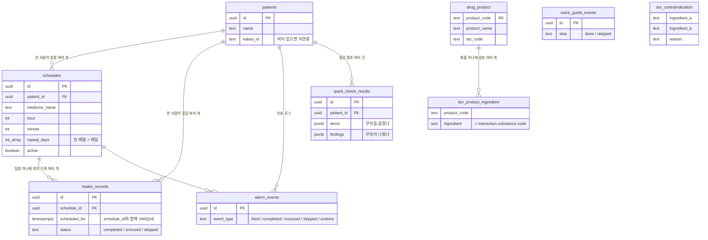
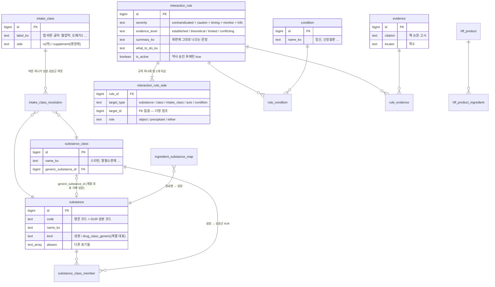

# 모두의 복약 — DB 구조(ERD) 공부용 안내서

작성 2026-10-05 · 기준 코드 `origin/main` 9ea9ec7 · 기준 DB Supabase 프로젝트 `atzosfqrzsfrveympcfj`

이 문서는 **데이터베이스를 처음 접하는 팀원**이 우리 앱의 DB가 어떻게 생겼는지 이해하기 위한 것이다.
정확한 컬럼 목록·타입이 필요하면 `docs/data-spec.md`(정식 데이터 명세서)를 보라.
여기서는 "왜 이렇게 나눴고, 앱이 어떤 순서로 쓰는가"를 말로 풀어 쓴다.

> **AI와 함께 공부하는 법**
> 이 파일 전체를 AI 대화창에 붙이고 아래처럼 물어보면 된다.
> - "patients와 schedules의 관계를 초등학생에게 설명하듯 말해 줘"
> - "사용자가 '아스피린'과 '오메가3'를 고르면 어떤 테이블을 어떤 순서로 거치는지 따라가 줘"
> - "intake_records에 unique 제약이 왜 필요한지 예를 들어 설명해 줘"
> - "interaction_rule_side의 다형 참조가 뭔지, 왜 FK가 없는지 설명해 줘"
> - "11장 연습 문제를 하나씩 내 주고 내 답을 채점해 줘"

---

## 1. 먼저 알아야 할 낱말 10개

우리 DB에 실제로 있는 것으로 예를 들었다.

| 낱말 | 뜻 | 우리 DB의 예 |
|---|---|---|
| **테이블(table)** | 엑셀 시트 하나. 같은 종류의 것을 모은 표 | `patients`(사용자), `schedules`(복용 일정) |
| **행(row)** | 표의 한 줄. 실제 데이터 한 건 | `patients`의 한 행 = 사용자 한 사람 |
| **컬럼(column)** | 표의 한 열. 어떤 정보를 담는 칸 | `schedules.hour` = 몇 시에 먹는지 |
| **기본키(PK, primary key)** | 행마다 하나씩 붙는 **절대 겹치지 않는 번호표** | 모든 테이블의 `id`. 우리는 `uuid`(아주 긴 난수)를 쓴다 |
| **외래키(FK, foreign key)** | 다른 테이블의 PK를 적어 둔 칸. "이 행은 저 행의 것이다"라는 화살표 | `schedules.patient_id` → `patients.id` |
| **1:N 관계** | 하나가 여러 개를 가진다 | 사용자 1명 : 일정 여러 개 |
| **N:M 관계** | 양쪽 다 여러 개. 중간에 연결 전용 테이블을 둔다 | 성분 ↔ 성분군을 잇는 `substance_class_member` |
| **UNIQUE 제약** | "이 조합은 표 안에 한 번만" 규칙 | `intake_records (schedule_id, scheduled_for)` |
| **upsert** | 있으면 고치고(update) 없으면 넣는다(insert) | 복약 응답 저장. 두 번 눌러도 행이 하나 |
| **스키마(schema)** | 테이블을 담는 폴더 | `public`(앱 데이터), `interaction`(약 지식) |

추가로 셋만 더.

- **jsonb** — 컬럼 하나에 JSON(중괄호 묶음)을 통째로 넣는 타입. 모양이 자주 바뀌는 데이터용. `quick_check_results.findings`가 이렇다.
- **RLS(행 수준 보안)** — 앱이 가진 열쇠(anon 키)로 어떤 동작을 할 수 있는지 테이블별로 정한 규칙. 예: 지표 테이블은 "넣기만 가능, 읽기 불가".
- **RPC(서버 함수)** — DB 안에 넣어 둔 프로그램. 앱이 이름만 부르면 서버가 대신 실행한다. `quick_check_v1`, `link_kakao` 두 개가 있다.

---

## 2. 큰 그림: 폴더 두 개

```
Supabase Postgres (DB 하나)
├─ public       ← 앱이 직접 읽고 쓰는 "사용자 데이터"  (9개 테이블)
│   사용자, 일정, 복약 기록, 지표 로그, 1분 점검 결과, 식약처 의약품 참조 자료
└─ interaction  ← 약사가 검수한 "약 지식"  (25개 테이블)
    성분 사전, 성분군, 상호작용 규칙, 근거, 건강기능식품 4만 6천 종
    → 앱은 직접 열지 못하고, 서버 함수 quick_check_v1 을 통해서만 답을 받는다
```

왜 나눴나.

1. **바뀌는 속도가 다르다.** 사용자 데이터는 매일 쌓이고, 약 지식은 약사가 검수할 때만 바뀐다.
2. **권한이 다르다.** 앱은 자기 일정은 고쳐도 되지만 약 규칙을 고치면 안 된다. 폴더를 나누면 "interaction은 앱에서 손대지 못함"을 한 줄로 막을 수 있다.
3. **설명하기 쉽다.** 심사·검토 때 "사용자 정보는 여기 9개, 의료 지식은 저기"라고 말할 수 있다.

---

## 3. public 스키마 — 앱이 쓰는 표 9개

### 3.1 그림



(그림 문법은 mermaid다. GitHub·Obsidian·VS Code 미리보기에서 그림으로 보이고, AI는 글자 그대로 읽어도 이해한다.)

### 3.2 표 하나씩, 한 문단씩

**`patients` — 사용자.** 한 행이 한 사람. 회원가입이 없기 때문에 비밀번호·이메일이 없다. 앱은 처음 쓸 때 행 하나를 만들고 그 `id`를 휴대폰에 저장해 두고, 다음부터 "내 행"을 그 id로 찾는다. 카카오로 연결하면 `kakao_id`(카카오 회원번호)가 채워지고, 휴대폰을 바꿨을 때 이 번호로 자기 행을 되찾는다. 이름 말고는 받지 않는다. `gender`, `birth_date`, `patient_code` 같은 칸이 남아 있지만 **옛 설계의 흔적이라 비어 있다**(보호자 기능·생년월일 입력은 회의에서 삭제).

**`schedules` — 복용 일정.** "약 하나 × 시간 하나"가 한 행. 아침 8시 혈압약, 저녁 7시 혈압약은 두 행이다. 알람은 전부 이 표에서 나온다. `repeat_days`는 요일 배열(0=일 … 6=토)인데 **빈 배열이면 매일**이다. 앱 전체가 이 약속을 전제로 짜여 있어 바꾸면 안 된다(설계 결정 1). `active=false`면 지운 것처럼 숨기되 과거 기록은 남긴다.

**`intake_records` — 복약 응답 기록.** 알람이 울려 사용자가 버튼을 누르면 한 행. "어떤 일정(`schedule_id`)의 어느 회차(`scheduled_for`)에 무엇을 눌렀나(`status`)". 핵심은 `(schedule_id, scheduled_for)` UNIQUE 제약이다. 알람은 같은 회차에 여러 번 울릴 수 있고(재알림, 다시 탭) 사용자가 두 번 누를 수도 있는데, 그래도 **한 회차에 행은 하나**여야 "복약률"이 맞다. 그래서 앱은 insert가 아니라 항상 **upsert**로 쓴다(설계 결정 2).

**`alarm_events` — 알람 지표 로그.** 분석용. 알람이 울린 시각(`fired`)과 응답 시각을 따로 남겨 "울리고 몇 분 뒤에 반응했나"를 볼 수 있다. 되돌리기(`undone`)도 남긴다. 앱은 **넣기만** 할 수 있고 읽지 못한다(RLS).

**`voice_guide_events` — 알람 설정 안내 화면 지표.** 온보딩에서 알람 설정을 끝까지 했는지(`done`) 건너뛰었는지(`skipped`)만 센다. 사용자 id가 없다(익명 집계). 이름에 voice가 남은 건 예전에 음성 안내가 있던 시절의 이름이고, 지금 앱에는 음성이 없다. 음성 관련 숫자 칸은 전부 0으로 들어간다.

**`quick_check_results` — 1분 복용 점검 결과.** 사용자가 고른 것(`items`)과 화면에 보인 판정(`findings`)을 JSON 그대로 저장한다. 왜 JSON인가: 판정 모양이 자주 바뀌고, "그때 화면에 뭐가 보였나"를 그대로 남기는 게 목적이기 때문. 임신·신장질환 같은 선택도 들어가므로 **건강 정보**로 취급한다(개인정보처리방침에 명시).

**`drug_product` — 식약처 의약품 제품 목록(2만 2천 종).** 읽기 전용 참조 자료. "리피토"처럼 상품명을 치면 여기서 찾는다. `atc_code`(WHO 약 분류 코드)가 있어 "이 약은 스타틴 계열"을 알 수 있다.

**`dur_product_ingredient` — 제품 → 성분.** 식약처 DUR 자료. 제품 코드 하나에 성분 여러 줄. `ingredient` 값이 interaction 쪽 `substance.code`와 같은 영문 코드라, 두 폴더를 잇는 **다리**다.

**`dur_contraindication` — 식약처 병용금기 성분쌍.** "성분 A와 B는 같이 못 쓴다"는 공식 고시 목록. 고시번호가 있어 심사·문의 때 근거로 쓴다.

### 3.3 앱 흐름을 표에 겹쳐 보기

```
[처음 실행] 이름 입력 ─────────────→ patients 행 1개 insert
[1분 점검] 영양제·약·조건 고르기 ──→ quick_check_v1 RPC 호출 (interaction을 읽음)
           결과 화면 ──────────────→ quick_check_results insert
[알람 설정] 시간 고르기 ───────────→ schedules insert (약 × 시간마다 1행)
[알람 울림] 화면 열림 ─────────────→ alarm_events insert (fired)
           버튼 누름 ──────────────→ intake_records upsert + alarm_events insert
[카카오 연결] ─────────────────────→ link_kakao RPC → patients.kakao_id 채움
[휴대폰 교체] 카카오로 불러오기 ───→ patients에서 kakao_id로 내 행 찾기
[데이터 삭제] ─────────────────────→ patients 행 delete → 일정·기록·로그가 함께 삭제(cascade)
```

마지막 줄의 **cascade**: FK에 "부모가 지워지면 자식도 지워라"를 걸어 두면 사용자 행 하나만 지워도 그 사람의 일정·기록이 전부 따라 지워진다. 개인정보 삭제가 한 번에 되는 이유다.

---

## 4. interaction 스키마 — 약 지식 25개

이쪽은 테이블이 많지만 **층이 다섯 개**뿐이다. 층 단위로 보면 쉽다.

```
① 입력 해석층   intake_class ──→ intake_class_resolution ──→ ② substance / substance_class
   (앱 버튼)       ("혈압약" 버튼은 어떤 성분군을 뜻하나)       (성분 사전·성분군)

③ 규칙층       interaction_rule ──┬── interaction_rule_side (규칙의 항: 성분 A, 성분군 B …)
                                   └── rule_condition (임신이면 등급 올림 등)

④ 근거층       evidence ←── rule_evidence ──→ interaction_rule     evidence_expression (근거 수준 → 문구)

⑤ 건기식층     hff_product ──→ hff_product_ingredient ──→ ingredient_substance_map ──→ substance
   (제품 4만 6천) (원료 62만 줄)                (원료명 → 성분)
```

그 외 **약리 속성층**(`effect_axis`, `substance_effect`, `substance_relation`, `substance_limit`)은 "출혈 축", "흡수 방해 4시간" 같은 성분 성질을 담는데, 지금 앱 판정은 ③ 규칙층만 읽는다. 다음 단계 재료라고 보면 된다.

### 4.1 핵심만 그린 그림



### 4.2 층별로 말로 풀기

**① 입력 해석층.** 사용자는 성분 이름을 모른다. "혈압약" 버튼을 누른다. `intake_class`가 그 버튼이고, `intake_class_resolution`이 "혈압약 = ARB·CCB·베타차단제·이뇨제 성분군"으로 풀어 준다. "오메가3" 버튼은 성분 하나로 바로 풀린다. **버튼은 UI 단위, 성분은 지식 단위**라서 둘을 분리했다. 버튼 글자를 바꿔도 지식은 그대로다.

**② 성분 사전.** `substance`가 **이 폴더의 허브**다. 약 690종. 영문 `code`가 식약처 DUR 성분 코드와 같아 `public.dur_product_ingredient`와 바로 이어진다. `aliases`에는 "메트포르민염산염"처럼 염 표기, 영문명, 흔한 오타 표기가 들어 있어 사용자가 직접 입력한 글자를 찾을 때 쓴다. `substance_class`는 "스타틴", "항혈소판제" 같은 성분군이고, `substance_class_member`가 성분과 성분군을 N:M으로 잇는다(아스피린은 항혈소판제이자 NSAID).

> **계열 대표 가짜 성분(`generic_substance_id`)** — 약사가 쓴 규칙은 "스타틴 × 홍국"처럼 **계열**을 항으로 둔다. 그런데 사용자는 "아토르바스타틴"을 입력한다. 이 둘을 잇기 위해 `substance`에 `kind='drug_class_generic'`인 "스타틴"이라는 가짜 성분 행을 두고, `substance_class.generic_substance_id`로 성분군에서 그 가짜 성분을 가리킨다. 서버 함수는 사용자의 실제 성분 → 소속 성분군 → 가짜 성분까지 집합에 넣어서 규칙과 맞춘다. 2026-10-03에 이 다리가 없어서 아스피린·스타틴 규칙이 전혀 걸리지 않던 일이 있었다.

**③ 규칙층.** `interaction_rule` 한 행이 "주의 조합" 하나. 화면에 나오는 문장(`summary_ko`, `what_to_do_ko`)이 여기 그대로 들어 있다 — 앱이 문장을 지어내지 않는다. `severity`는 심각도, `evidence_level`은 근거 수준이다. `is_active`는 **약사가 `review_status='approved'`로 승인해야만 true가 될 수 있다**(DB CHECK 제약). 앱은 `is_active=true`만 읽는다.

규칙의 **항**(누구와 누구)은 `interaction_rule_side`에 한 줄씩. 항은 성분일 수도, 성분군일 수도, 버튼일 수도, 조건일 수도 있어서 `target_type` + `target_id` 두 칸으로 "어느 표의 몇 번"을 적는다. 이것을 **다형 참조**라 한다. 보통 FK는 한 표만 가리킬 수 있어 FK를 걸 수 없고, 그래서 성분을 지우면 고아 항이 남을 위험이 있다. 검수용 점검 쿼리로 주기적으로 확인해야 한다(상호작용 DB 검토 PDF의 A1 점검. 저장소에는 아직 그 SQL이 없다).

`role`은 판정 방식이다. **object(필수) 항은 전부 있어야 하고, precipitant/either(둘 중 하나) 항은 하나 이상 있으면 된다.** 예: "PPI × (마그네슘 또는 비타민B12)" 규칙에서 PPI는 object, 영양소들은 either. 사용자가 PPI와 마그네슘만 골라도 걸린다. 처음에는 전부 object로 들어가 있어서 둘 다 골라야만 걸렸고, 10월에 고쳤다.

`rule_condition`은 "이소플라본은 기본 info지만 유방암 조건이면 금기로 올림" 같은 조건 수정자다. 지금은 비어 있고(0행), 임신 같은 조건은 `interaction_rule_side`에 `target_type='condition'` 항으로 직접 넣어 쓴다.

**④ 근거층.** `evidence`는 책 쪽수·논문·식약처 고시 같은 출처. `rule_evidence`가 규칙과 N:M으로 잇고, `relation='contradicts'`면 "근거가 엇갈린다"는 뜻. `evidence_expression`은 근거 수준(`established` 등)을 화면 문구("연구로 확인됨")로 바꾸는 작은 표다. 심사관이 "이 경고의 근거가 무엇이냐"고 물으면 이 층에서 답한다.

**⑤ 건기식층.** 식약처 건강기능식품 품목 4만 6천 종(`hff_product`)과 그 원료 62만 줄(`hff_product_ingredient`). 원료명은 "홍국쌀추출분말(모나콜린K 2%)"처럼 제품마다 표기가 달라서 `ingredient_substance_map`이 원료명 원문 → 성분으로 이어 준다(자동 89% + 약사 검수). 사용자가 "OO 홍국 캡슐"이라는 제품명을 치면 이 층을 거쳐 성분 "홍국"이 된다. `hff_stage`는 CSV를 적재할 때 쓴 임시 표고, 서비스는 읽지 않는다.

**그 밖에 5개** (`hff_product_substance`, `hff_unmapped_ingredient`, `substance_pair_candidate`, `review_expression`, `adverse_event`)는 검수·통계용 파생 표다. 앱의 판정은 읽지 않는다.

---

## 5. 서버 함수 두 개

**`quick_check_v1(p_names, p_age, p_conditions)`** — 1분 점검의 두뇌. 앱은 interaction 폴더를 직접 못 열고 이 함수만 부른다(security definer: 함수가 자기 권한으로 읽어서 결과만 돌려준다). 안에서 하는 일:

1. 입력 이름 하나하나를 **버튼 → 성분(이름·별칭) → 건기식 제품명 → 의약품 제품명** 순서로 해석해 성분 집합을 만든다.
2. 성분이 속한 성분군의 "계열 대표 가짜 성분"을 집합에 더한다(4.2 ②).
3. `is_active` 규칙마다 항을 대조한다. object 전부 + precipitant/either 하나 이상.
4. 걸린 규칙의 문장·심각도·근거 수준과, **해석하지 못한 입력 이름**, **판정에 쓰지 못한 조건**(예: 신장질환은 아직 규칙이 없음)을 함께 돌려준다. 앱은 이 "못 본 것"을 화면 아래에 그대로 보여 준다.

**`link_kakao(p_patient_id, p_kakao_id)`** — 카카오 연결. 앱 열쇠로는 `patients`를 update할 수 없게 막아 놨기 때문에, 이 함수가 대신 `kakao_id`를 채운다. 이미 다른 카카오와 연결돼 있으면(`already_linked`), 그 카카오가 다른 사람 행에 붙어 있으면(`taken`) 실패 이유를 돌려준다.

---

## 6. 절대 깨면 안 되는 약속 3개 (AGENTS.md)

| # | 약속 | 어디에 걸려 있나 | 깨지면 |
|---|---|---|---|
| 1 | `schedules.repeat_days = []`는 **매일** | 앱 전체 + 알람 예약 로직 | 매일 먹는 약 알람이 하나도 안 울림 |
| 2 | `intake_records`는 항상 **upsert**(`schedule_id, scheduled_for`) | DB UNIQUE 제약 + 앱 저장 코드 | 같은 회차 행이 둘 → 복약률 틀림, insert 자체가 에러 |
| 3 | 알람 응답은 **화면 버튼으로만** 받는다 | 앱 (DB와 무관) | 음성 인식 흔적이 생기면 심사·방침 위반 |

---

## 7. 따라가 보기 ① — "아스피린 + 오메가3"

1. 사용자: 1/3에서 **오메가3** 버튼, 2/3에서 직접 입력 **아스피린**, 3/3에서 60대 이상·해당 없음.
2. 앱 → `quick_check_v1(['오메가3','아스피린'], '60대 이상', [])`.
3. 함수: "오메가3"는 `intake_class` 버튼 → `intake_class_resolution` → 성분 `omega3`. "아스피린"은 `substance.name_ko`에서 바로 `aspirin`.
4. `substance_class_member`에서 aspirin은 **항혈소판제**, **항혈전제** 성분군 소속 → 각 성분군의 `generic_substance_id`(가짜 성분 "항혈소판제", "항혈전제")를 집합에 추가.
5. `interaction_rule` 중 `is_active=true`인 규칙을 돌며 `interaction_rule_side`와 대조. "항혈소판제 × 오메가3(출혈 위험)"와 "항혈전제 × 오메가3" 두 규칙의 항이 모두 채워짐.
6. 반환: findings 2건(문장·심각도 caution·근거 수준), unmatched 0, uncovered conditions 0.
7. 앱: 결과 화면에 "확인 필요 2건" 표시 → `quick_check_results`에 items(고른 것)·findings(나온 것) insert.

같은 방법으로 "암로디핀 + 자몽"을 따라가 보라. 암로디핀은 CCB 성분군 → 가짜 성분 "CCB" → "CCB × 자몽" 1건. 스타틴 규칙은 걸리지 않아야 한다(한때 복합제 제품명 때문에 암로디핀이 스타틴 성분군에 잘못 들어간 적이 있었다).

## 8. 따라가 보기 ② — 아침 8시 알람에 "지금 약 먹기"

1. `schedules` 행: 혈압약, hour 8, minute 0, repeat_days `[]`(매일).
2. 08:00 알람 울림 → 알람 화면 열림 → `alarm_events` insert (`fired`, scheduled_for = 오늘 08:00).
3. 사용자가 "지금 약 먹기" → `intake_records` **upsert** `{schedule_id, scheduled_for: 오늘 08:00, status: completed}` + `alarm_events` insert (`completed`).
4. 8초 안에 "잘못 눌렀어요" → `intake_records`의 그 행을 지우거나 이전 상태로 되돌림 + `alarm_events` insert (`undone`).
5. 사용자가 알림을 다시 탭해 화면이 또 열려도, 같은 `(schedule_id, 오늘 08:00)`이라 행이 늘지 않는다.
6. 기록 화면의 "약 챙겨 드신 비율" = 이 달의 `intake_records`에서 completed 수 ÷ 예정 회차 수.

---

## 9. 지금 알려진 빈틈 (공부하면서 같이 보면 좋은 것)

- `interaction_rule_side.target_id`에 FK가 없다(다형 참조). 성분을 지울 때 고아 항이 생길 수 있어 점검 쿼리가 필요하다(저장소에 아직 없음).
- `intake_class`에 **여드름약·알레르기약·통증소염제** 버튼은 있지만 규칙이 없거나 해석이 비어 있다. 앱은 이걸 "점검하지 못한 항목"으로 보여 준다.
- 조건 중 **신장질환·간질환**은 규칙에 아직 없다. 역시 "확인하지 못한 정보"로 노출.
- `patients`에 쓰지 않는 칸(`gender`, `birth_date`, `patient_code`, `phone`, `region`)이 남아 있다. 과거 행 보존 때문에 두었고, 앱은 쓰지 않는다.
- interaction의 파생 표 5개는 저장소에 DDL(만든 SQL)이 없다. DB에서 직접 만든 것이라 정리가 필요하다.
- `voice_guide_events`라는 이름은 옛 이름이다. 음성은 없고 "알람 설정 안내를 마쳤나"만 센다.

---

## 10. 어디에 무엇이 있나

| 보고 싶은 것 | 파일 |
|---|---|
| 모든 컬럼·타입 (정식 명세) | `docs/data-spec.md` |
| 테이블 만드는 SQL(public) | `care-app/supabase/schema.sql`, `migrate-*.sql` |
| 서버 함수 `quick_check_v1` 본문 | `care-app/supabase/migrate-quick-check-rpc.sql` |
| 카카오 연결 함수 | `care-app/supabase/migrate-kakao-link.sql` |
| 앱 열쇠의 권한(RLS) | `care-app/supabase/migrate-rls-tier1.sql` |
| 성분 사전 확장·별칭·계열 다리 | `migrate-substance-expand.sql`, `migrate-substance-aliases.sql`, `migrate-class-bridge.sql`, `migrate-atc-class-members.sql` |
| 앱 버튼 ↔ DB 이름 대응 | `care-app/src/lib/chipAliases.ts`, `conditionAliases.ts` |
| 서버와 앱 라벨이 맞는지 자동 점검 | `cd care-app && npm run check:server` |
| 팀원 QA 케이스(어떤 조합이 걸려야 하나) | `docs/qa-quick-check-cases.md` |
| 서버 쪽 남은 일 | `docs/quick-check-server-gap.md` |

---

## 11. 연습 문제 (AI에게 채점 받기)

1. 사용자 한 명이 약 3개를 아침·저녁에 먹는다. `schedules`에 행이 몇 개 생기나?
2. `intake_records`에 `(schedule_id, scheduled_for)` UNIQUE가 없다면 어떤 일이 생길 수 있나? 두 가지 시나리오를 들어 보라.
3. `repeat_days`가 `[1,3,5]`인 일정은 언제 울리나? `[]`이면?
4. "혈압약" 버튼을 눌렀을 때 거치는 테이블을 순서대로 적어 보라(힌트: 3개 + 성분군).
5. `interaction_rule_side`에 왜 FK를 걸 수 없나? 대신 무엇으로 안전을 지키나?
6. 규칙 "PPI × 마그네슘 / 비타민B12"에서 role을 어떻게 줘야 "PPI + 마그네슘"만 골라도 걸리나?
7. 아토르바스타틴을 입력했을 때 "스타틴 × 홍국" 규칙이 걸리기 위해 필요한 다리는 무엇인가?
8. 사용자가 "모든 데이터 삭제"를 누르면 DB에서 무슨 일이 일어나나? cascade라는 말을 써서 설명하라.
9. 앱이 `alarm_events`를 읽을 수 없는 이유와, 그래도 앱 동작에 문제가 없는 이유는?
10. 심사관이 "이 경고의 근거가 무엇이냐"고 물으면 어느 테이블에서 답을 찾나?

---

## 12. 낱말 사전

- **anon 키** — 앱에 들어 있는 공개 열쇠. 누구나 가질 수 있어 RLS로 할 수 있는 일을 제한한다.
- **ATC 코드** — WHO의 약 분류 코드. `B01AC`는 항혈소판제. 심평원 매핑으로 `drug_product`에 들어 있다.
- **cascade** — 부모 행을 지우면 자식 행도 함께 지우는 FK 옵션.
- **DUR** — 식약처 의약품 안전사용 서비스. 병용금기·성분 자료의 출처.
- **HFF** — 건강기능식품(Health Functional Food). `hff_*` 테이블.
- **security definer** — 함수가 호출자 권한이 아니라 함수 소유자 권한으로 실행되는 옵션. 앱이 못 읽는 폴더를 함수가 대신 읽어 주는 방식.
- **upsert** — insert + update. 충돌 기준 컬럼(`onConflict`)을 정해 두면 같은 키가 있을 때 덮어쓴다.
- **다형 참조** — 한 칸이 여러 표 중 하나를 가리키는 방식. 유연하지만 FK 보호가 없다.
- **파생 표** — 다른 표를 계산해 미리 풀어 둔 표. 원본이 바뀌면 다시 만들어야 한다.
